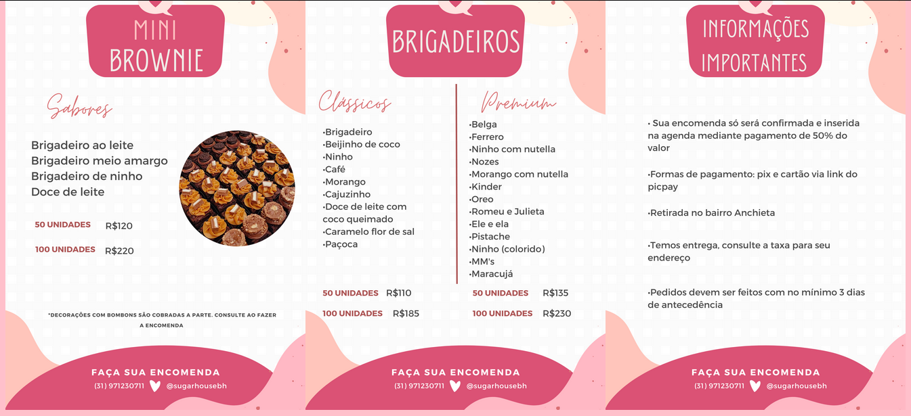

<h1 align="center">Sugar House WebSite</h1>

O projeto Sugar House WebSite foi desenvolvido como parte do Laboratório de Extensão obrigatório da Estácio, na disciplina de Desenvolvimento Rápido de Aplicações em Python. Este laboratório tem como objetivo proporcionar uma experiência prática que complementa os conhecimentos teóricos adquiridos durante o curso, promovendo a aplicação de conceitos de desenvolvimento python utilizando a metodologia RAD em um cenário real.

Através dessa atividade, buscamos não apenas consolidar o aprendizado acadêmico, mas também engajar a comunidade local em um projeto de valor social. Para isso, foi estabelecida uma parceria com a confeitaria Sugar House, localizada em Belo Horizonte, Minas Gerais. A colaboração com esta empresa permitiu o desenvolvimento de uma solução personalizada que atende às necessidades específicas do negócio, ao mesmo tempo em que proporcionou uma experiência prática enriquecedora.

## Índice
- [Índice](#índice)
- [Status do Projeto](#status-do-projeto)
- [Layout](#layout)
- [Funcionalidades](#funcionalidades)
- [Como Rodar A Aplicação](#como-rodar-a-aplicação)
- [Tecnologias Utilizadas](#tecnologias-utilizadas)
- [Estrutura de Diretórios](#estrutura-de-diretórios)
- [Padrões Utilizados](#padrões-utilizados)
- [Metodologia de Desenvolvimento](#metodologia-de-desenvolvimento)
- [Desenvolvedor](#desenvolvedor)
- [Licença](#licença)

## Status do Projeto
Finalizado ✅

## Layout

**Index**

  

**Cardápio**

  

**Sobre Nós**

**Contato**

## Funcionalidades
1. **Página Inicial**: Visão geral sobre a confeitaria e avaliações de clientes.
2. **Cardápio**: Listagem detalhada dos produtos disponíveis com descrições e preços
3. **Contato**: Informações de contato/canais oficiais da confeitaria.
4. **Sobre Nós**: Um pouco mais sobre a história da confeitaria.

## Como Rodar A Aplicação

1. Clone o repositório usando o comando:
    
    git clone https://github.com/PedroNunesBH/sugar_house_app.git

2. Navegue até o diretório do projeto

3. Instale as dependências necessárias listadas no arquivo requirements.txt:

    pip install -r requirements.txt
    
4. Execute as migrações do banco de dados:

    python manage.py migrate
    
5. Inicie o servidor de desenvolvimento:

    python manage.py runserver
    
6. Acesse a aplicação em: http://localhost:8000/

    

## Tecnologias Utilizadas
- [HTML](https://www.w3.org/html/)
- [CSS](https://developer.mozilla.org/pt-BR/docs/Web/CSS)
- [Git](https://git-scm.com/)
- [Python](https://www.python.org/)
- [Django](https://www.djangoproject.com/)

## Estrutura de Diretórios

    my_django_project/
        │
        ├── app/
        │   ├── __init__.py             # Indica que este diretório é um pacote Python.
        │   ├── admin.py                # Configurações para o painel de administração do Django.
        │   ├── apps.py                 # Configurações da aplicação, incluindo nome e configuração.
        │   ├── models.py               # Definição dos modelos de dados da aplicação.
        │   ├── tests.py                # Testes automatizados para a aplicação.
        │   ├── views.py                # Lógica das views da aplicação, responsável pelo processamento de requisições.
        │   └── templates/              # Pasta para templates da aplicação 'app'.
        │
        ├── confectionery/
        │   ├── __init__.py             # Indica que este diretório é um pacote Python.
        │   ├── apps.py                 # Configurações da aplicação, incluindo nome e configuração.
        │   ├── forms.py                # Definição dos formulários da aplicação.
        │   ├── urls.py                 # Definição das urls da aplicação.
        │   ├── views.py                # Lógica das views da aplicação, responsável pelo processamento de requisições.
        │   └── templates/              # Pasta para templates da aplicação 'confectionery'.
        │
        ├── static/
        │   ├── css/                    # Pasta para arquivos CSS usados no site.
        │   └── images/                 # Pasta para imagens usadas no site.
        │
        ├── .gitignore                  # Arquivo para especificar quais arquivos e diretórios o Git deve ignorar.
        ├── manage.py                   # Script de gerenciamento do Django, usado para executar comandos administrativos.
        ├── README.md                   # Arquivo de documentação do projeto, geralmente contém uma descrição do projeto e instruções de uso.
        └── requirements.txt            # Arquivo com as dependências do projeto, especificando quais pacotes Python são necessários para o projeto.
    
## Padrões Utilizados
1. **Commits Semânticos**: Os commits do projeto seguem o padrão de commits semânticos facilitando o entendimento e a padronização.

## Metodologia de Desenvolvimento
Para o desenvolvimento do sistema foi utilizada a metodologia RAD.

Rapid Application Development (RAD) é uma abordagem de desenvolvimento de software que enfatiza a rapidez e a eficiência na criação de aplicações. O RAD foca na entrega rápida de protótipos funcionais e em uma iteração contínua com os usuários finais para ajustar e melhorar o produto ao longo do processo.

## Desenvolvedor
- [Pedro Henrique Silveira Nunes](https://github.com/PedroNunesBH)

##  Licença
Este projeto está licenciado sob uma licença proprietária. Todos os direitos são reservados ao proprietário do projeto. O uso, modificação ou distribuição deste código não é permitido sem a devida autorização.